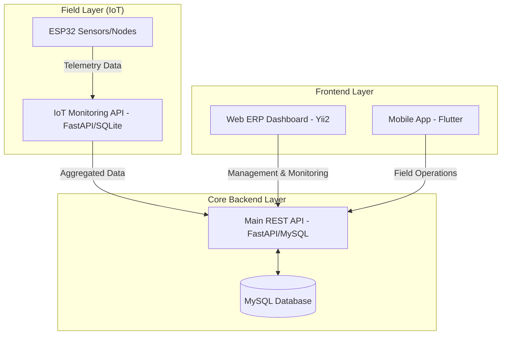

# System Architecture Overview - iSURF Project

## 1. Pendahuluan
Dokumen ini memberikan gambaran umum tentang arsitektur sistem **iSURF (Integrated Smart Urban Farming)**. Sistem ini dirancang untuk mengintegrasikan pemantauan IoT, manajemen data melalui web, dan akses mobilitas bagi pengguna lapangan.

## 2. Diagram Arsitektur Tingkat Tinggi

## 3. Komponen Sistem

### 3.1 Core Backend API (`apps/api`)
Pusat logika bisnis dan orkestrasi data. Dibangun menggunakan **FastAPI** dengan pola *Layered Architecture*.
- **Tanggung Jawab:** Manajemen user (RBAC), pengolahan data ternak/tanaman, dan penyediaan endpoint RESTful untuk Web dan Mobile.
- **Database:** MySQL/MariaDB sebagai penyimpanan utama.

### 3.2 Web Dashboard (`apps/web`)
Antarmuka manajemen utama untuk administrator dan staf internal. Menggunakan **Yii2 Advanced Template**.
- **Tanggung Jawab:** Visualisasi data real-time, manajemen inventory, pelaporan, dan pengaturan sistem (RBAC).

### 3.3 Mobile Application (`apps/mobile`)
Aplikasi berbasis **Flutter** untuk akses via mobile.
- **Tanggung Jawab:**  notifikasi real-time, dan pemantauan kondisi sensor secara mobile.

### 3.4 IoT & Monitoring (`apps/iot`)
Komponen perangkat keras dan API lokal untuk pengumpulan data sensor.
- **Tanggung Jawab:** Pengumpulan data dari sensor ESP32, penyimpanan sementara di SQLite (via Monitoring API), dan sinkronisasi ke API utama.

## 4. Alur Data Utama (Data Flow)
1.  **Pengumpulan Data:** Sensor ESP32 mengirimkan data ke **IoT Monitoring API**.
2.  **Ingestion:** IoT API meneruskan data yang telah divalidasi ke **Main REST API**.
3.  **Penyimpanan:** Main API menyimpan data ke dalam **MySQL Database**.
4.  **Konsumsi:** **Web Dashboard** dan **Mobile App** mengambil data terbaru dari Main API untuk ditampilkan kepada pengguna.

## 5. Infrastruktur
Sistem dikelola menggunakan teknologi modern untuk skalabilitas:
- **Docker:** Untuk kontainerisasi layanan.
- **GitLab CI/CD:** Untuk otomatisasi testing dan deployment.
- **Kubernetes (Helm):** Untuk orkestrasi di lingkungan produksi.
