# Activity Diagram - iSURF Project

Dokumen ini merinci Activity Diagram untuk masing-masing Use Case dalam sistem **iSURF (Integrated Smart Urban Farming)**. Setiap diagram aktivitas menggambarkan aliran kontrol operasional sistem secara konseptual dan abstrak tanpa detail teknis atau referensi implementasi kode program.

---

## Daftar Isi
1. [UC01: Login & Authentication](#uc01-login--authentication)
2. [UC02: Monitoring Real-time Area Data](#uc02-monitoring-real-time-area-data)
3. [UC03: Manage Areas, Sensors & Actuators](#uc03-manage-areas-sensors--actuators)
4. [UC04: Configure Sensor Thresholds](#uc04-configure-sensor-thresholds)
5. [UC05: Configure Automation Rules](#uc05-configure-automation-rules)
6. [UC06: Manual Trigger Actuator](#uc06-manual-trigger-actuator)
7. [UC07: Ingest Sensor Data](#uc07-ingest-sensor-data)
8. [UC08: Update Online Status](#uc08-update-online-status)
9. [UC09: Request Dataset](#uc09-request-dataset)
10. [UC10: Review Dataset Request](#uc10-review-dataset-request)
11. [UC11: Download Dataset](#uc11-download-dataset)

---

### UC01: Login & Authentication
Menggambarkan alur aktivitas saat pengguna melakukan masuk log (login) ke platform.

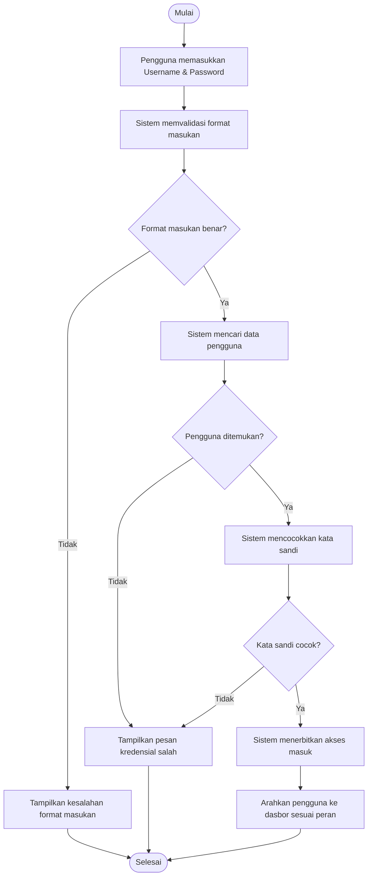

**Penjelasan Alur:**
1. Pengguna memasukkan nama pengguna dan kata sandi.
2. Sistem memeriksa format masukan. Jika tidak sesuai ketentuan, proses dibatalkan dengan menampilkan pesan kesalahan format.
3. Sistem memeriksa keberadaan nama pengguna. Jika tidak ada di sistem, akses ditolak dengan menampilkan pesan kesalahan kredensial.
4. Jika nama pengguna terdaftar, sistem mencocokkan kata sandi. Jika tidak cocok, akses ditolak.
5. Jika kata sandi cocok, sistem menerbitkan akses otentikasi dan mengarahkan pengguna ke dasbor utama sesuai perannya.

---

### UC02: Monitoring Real-time Area Data
Menggambarkan alur aktivitas pengguna saat memantau data kondisi lahan pertanian secara real-time pada dasbor.

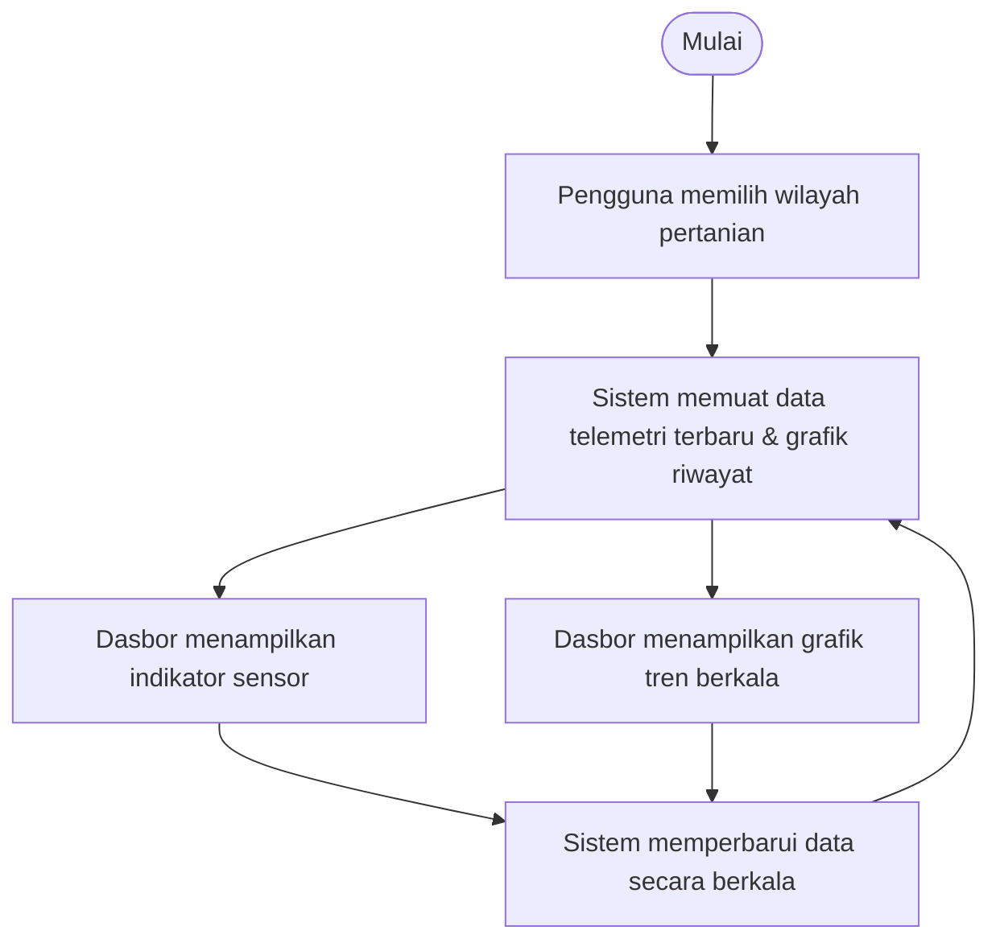

**Penjelasan Alur:**
1. Pengguna membuka dasbor pemantauan dan memilih salah satu wilayah pertanian (seperti area Greenhouse atau Nursery).
2. Sistem memuat informasi pembacaan sensor terbaru serta riwayat grafik dari wilayah tersebut.
3. Dasbor menampilkan data terkini dalam bentuk widget indikator (kelembaban, pH, TDS, suhu) dan kurva tren historis.
4. Sistem melakukan pembaruan berkala secara otomatis untuk memastikan data dasbor selalu mutakhir.

---

### UC03: Manage Areas, Sensors & Actuators
Menggambarkan alur pengelolaan data master wilayah (Area), perangkat sensor, dan aktuator kontrol oleh Administrator.

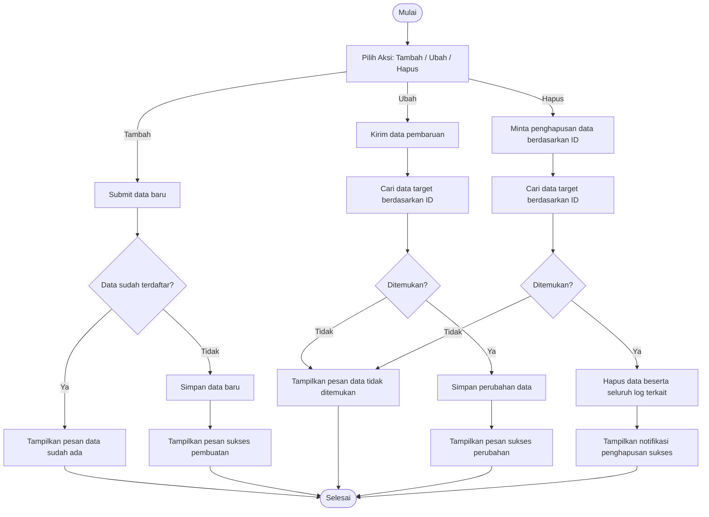

**Penjelasan Alur:**
1. Administrator memilih menu penambahan, pembaruan, atau penghapusan wilayah, sensor, atau aktuator.
2. **Tambah:** Sistem menguji keunikan data masukan. Jika data sudah ada, sistem menolaknya. Jika baru, data disimpan.
3. **Ubah:** Sistem memverifikasi keberadaan data master sebelum menyimpan perubahan informasi yang diinput administrator.
4. **Hapus:** Sistem menghapus data target beserta seluruh riwayat transaksi log data dan aturan aturan otomatisasi yang melekat pada data tersebut.

---

### UC04: Configure Sensor Thresholds
Menggambarkan pengaturan ambang batas aman peringatan sensor di suatu wilayah.

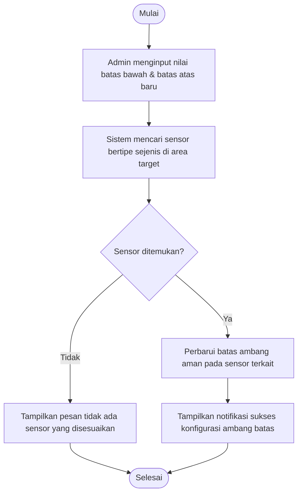

**Penjelasan Alur:**
1. Administrator memasukkan ambang batas bawah (minimal) dan batas atas (maksimal) untuk tipe pengukuran sensor tertentu pada suatu area.
2. Sistem mencari seluruh sensor sejenis yang terpasang pada area pertanian tersebut.
3. Sistem memperbarui nilai konfigurasi ambang batas pada sensor-sensor tersebut dan menampilkan pemberitahuan berhasil kepada administrator.

---

### UC05: Configure Automation Rules
Menggambarkan pembuatan aturan logika otomasi peralatan kontrol irigasi.

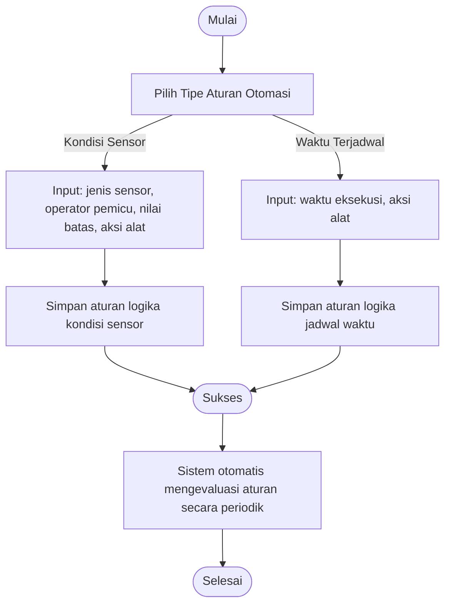

**Penjelasan Alur:**
1. Administrator menentukan logika kontrol peralatan irigasi otomatis untuk suatu wilayah pertanian.
2. **Aturan Kondisi:** Mengatur agar peralatan aktif berdasarkan pembacaan sensor (contoh: nyalakan pompa jika kelembaban tanah kurang dari 40%).
3. **Aturan Jadwal:** Mengatur agar peralatan aktif pada jam-jam tertentu (contoh: matikan pompa setiap jam 07:00).
4. Aturan disimpan dan dievaluasi terus-menerus oleh sistem pemantau latar belakang berdasarkan data telemetri terkini.

---

### UC06: Manual Trigger Actuator
Menggambarkan alur eksekusi ketika pengguna mengontrol saklar peralatan penyiraman secara manual.

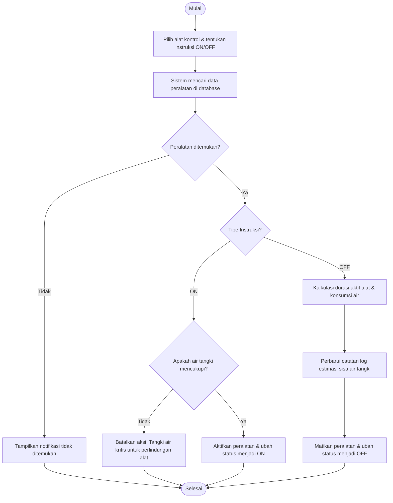

**Penjelasan Alur:**
1. Pengguna menekan tombol saklar untuk menghidupkan atau mematikan peralatan aktuator (seperti pompa air).
2. **Nyalakan (ON):** Sistem menguji cadangan air tangki terlebih dahulu. Jika air berada pada level kritis, perintah ditolak demi melindungi pompa dari kerusakan akibat menyala tanpa air (*failsafe*). Jika aman, pompa dinyalakan.
3. **Matikan (OFF):** Sistem menghitung durasi aktif pompa, menghitung taksiran volume air yang telah disalurkan, memperbarui sisa persediaan tangki air, dan mencatat log penggunaan sebelum mematikan peralatan.

---

### UC07: Ingest Sensor Data
Menggambarkan pemrosesan data pembacaan sensor yang dikirimkan secara otomatis dari lapangan oleh modul IoT.

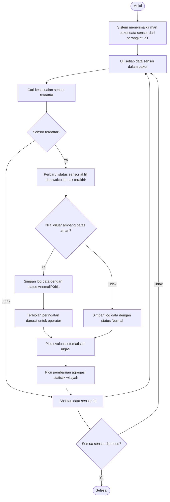

**Penjelasan Alur:**
1. Modul mikrokontroler mengirimkan sekumpulan data telemetry hasil sensor lapangan ke sistem.
2. Untuk setiap data sensor yang dikenali, status sensor ditandai aktif (*online*) dan waktu laporan diperbarui.
3. Jika nilai telemetry melanggar ambang batas aman, data dicatat sebagai anomali kritis dan sistem membuat peringatan (*alert*) darurat. Jika aman, data dicatat normal.
4. Sistem memicu evaluasi aturan otomatisasi irigasi wilayah serta perhitungan agregasi statistik wilayah di latar belakang agar respon ke perangkat IoT tetap cepat.

---

### UC08: Update Online Status
Menggambarkan deteksi status keaktifan koneksi sensor online/offline.

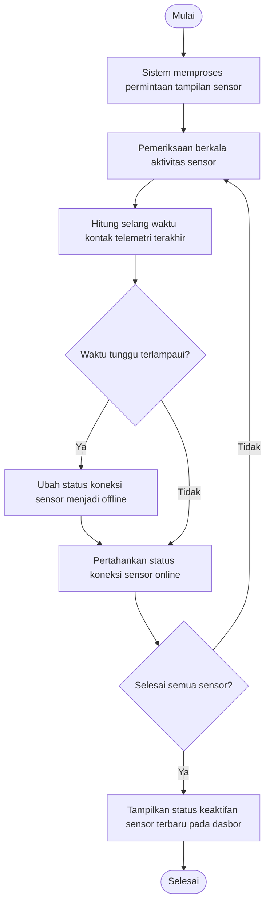

**Penjelasan Alur:**
1. Sistem memantau keaktifan koneksi sensor saat dasbor diakses.
2. Sistem mengecek selang waktu kontak data sensor terakhir. Jika sensor tidak melaporkan telemetri dalam rentang waktu yang ditentukan (misalnya 5 menit), status konektivitas diubah menjadi tidak aktif (*offline*).
3. Status koneksi terbaru (online/offline) ditampilkan secara visual pada dasbor.

---

### UC09: Request Dataset
Menggambarkan alur pengajuan izin akses unduhan dataset historis oleh pengguna eksternal (peneliti/akademisi).

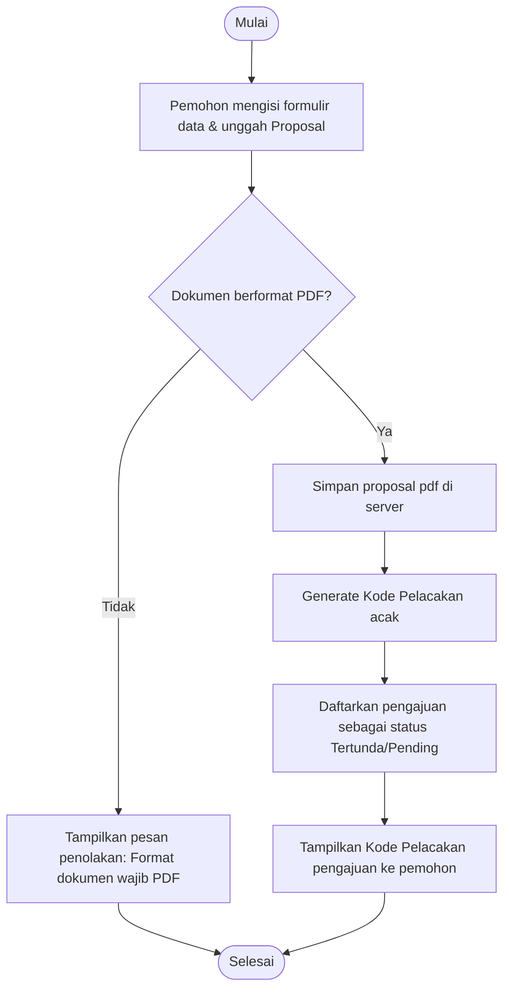

**Penjelasan Alur:**
1. Pemohon mengisi form identitas, tujuan riset, jangka waktu data, serta mengunggah surat izin/proposal riset.
2. Sistem menguji kesesuaian berkas unggahan (wajib dokumen PDF). Jika tidak sesuai, pengajuan ditolak.
3. Berkas PDF disimpan secara aman di direktori server.
4. Sistem membuat Kode Pelacakan unik (misal: "B7EF32A9") dan menyimpan data pengajuan dengan status tertunda (*pending*) agar pemohon dapat memantau status pengajuannya.

---

### UC10: Review Dataset Request
Menggambarkan proses peninjauan dan ulasan pengajuan data oleh Administrator.

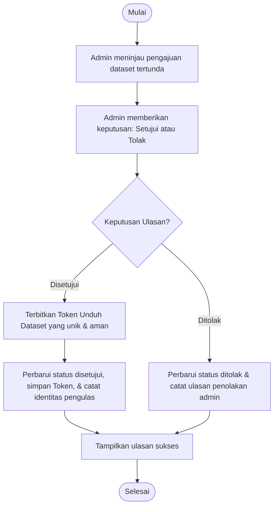

**Penjelasan Alur:**
1. Administrator memeriksa kesesuaian metadata form pengajuan serta berkas dokumen proposal yang dilampirkan peneliti.
2. Jika disetujui (**Setujui**), sistem menerbitkan token keamanan unduh dataset yang unik. Token ini berfungsi sebagai kunci pembuka unduhan.
3. Jika ditolak (**Tolak**), status diubah menjadi ditolak tanpa menerbitkan token, disertai penulisan catatan alasan penolakan dari administrator.

---

### UC11: Download Dataset
Menggambarkan pengunduhan berkas dataset historis secara aman.

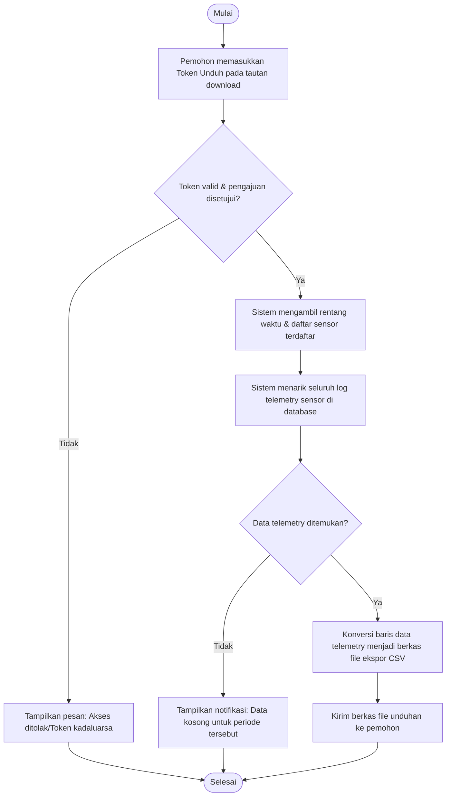

**Penjelasan Alur:**
1. Pemohon mengakses tautan download dengan menyertakan token unduhan yang diterimias saat disetujui admin.
2. Sistem mengecek status pengajuan terkait token. Jika tidak valid atau pengajuan belum disetujui, sistem menampilkan kesalahan akses ditolak.
3. Jika disetujui, sistem membaca batas tanggal dan sensor yang diperbolehkan, menarik seluruh log telemetry terkait dari database, mengonversi data tersebut menjadi file format tabel (CSV), dan mengirimkannya sebagai file unduhan langsung kepada pemohon.
