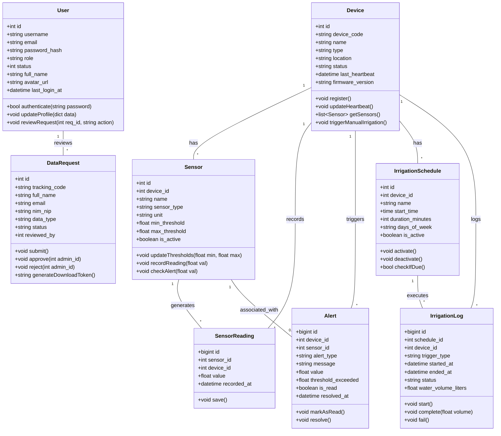
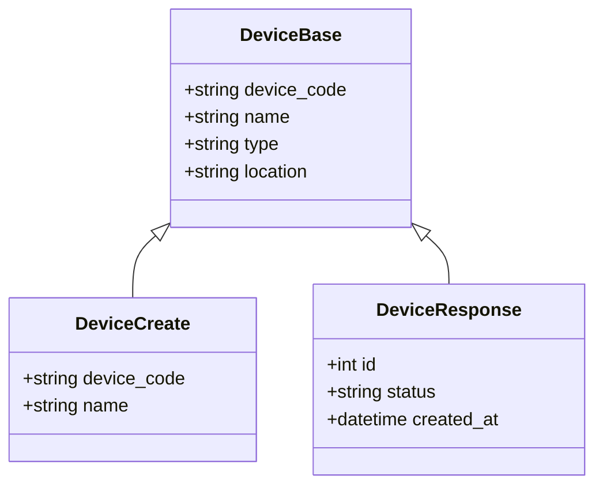

# Class Diagram - iSURF Project

Dokumen ini merinci struktur kelas internal sistem, menampilkan relasi utuh antar entitas di tingkat basis data (SQLAlchemy Models) dan penjelasan untuk masing-masing kelas.

## 1. Domain Model (SQLAlchemy Entities)
Berikut adalah relasi antar model inti dalam sistem iSURF secara komprehensif:

---

## 2. Penjelasan Class
Berikut adalah penjelasan fungsionalitas dari setiap kelas utama di atas:

### **`User`**
Merepresentasikan entitas pengguna dalam sistem, mencakup administrator maupun peneliti. Mengelola kredensial otentikasi (username, password hash) dan informasi profil dasar. Aktor dengan *role* admin berwenang meninjau permintaan data.

### **`Device`**
Merepresentasikan perangkat keras IoT (seperti Node ESP32) yang terpasang di lapangan. Kelas ini melacak identitas perangkat (`device_code`), lokasi, status online/offline (`last_heartbeat`), dan versi firmware. Merupakan entitas induk (parent) bagi sensor dan jadwal penyiraman.

### **`Sensor`**
Mendefinisikan modul sensor spesifik (misal: sensor pH, TDS, atau kelembapan tanah) yang terhubung ke sebuah `Device`. Kelas ini menyimpan nilai referensi seperti `min_threshold` dan `max_threshold` yang digunakan untuk memicu peringatan jika nilai pembacaan melebihi batas aman.

### **`SensorReading`**
Merupakan log data time-series (telemetry) hasil pembacaan dari `Sensor` fisik pada waktu tertentu. Sangat penting untuk fitur *monitoring* dan *analytics*. Terhubung langsung dengan `Sensor` dan `Device`.

### **`Alert`**
Entitas yang dibuat secara otomatis (atau manual) ketika anomali terdeteksi, misalnya ketika nilai `SensorReading` keluar dari batas `min_threshold` atau `max_threshold` sensor terkait. Berguna untuk memberikan peringatan dini kepada staf di lapangan.

### **`IrrigationSchedule`**
Mendefinisikan jadwal rutin otomatis untuk proses penyiraman di suatu `Device`. Mengatur jam mulai (`start_time`), durasi (`duration_minutes`), dan hari-hari aktif (`days_of_week`).

### **`IrrigationLog`**
Catatan riwayat penyiraman yang telah terjadi. Melacak apakah penyiraman dipicu secara manual, berdasarkan jadwal (`schedule_id`), atau dipicu otomatis oleh sensor. Mengabadikan waktu mulai, waktu selesai, dan status keberhasilan penyiraman.

### **`DataRequest`**
Menampung formulir permintaan dataset historis yang diajukan oleh pengguna/peneliti. Mengandung informasi pemohon dan status persetujuan yang direview oleh `User` (Admin).

---

## 3. API Data Transfer Objects (Pydantic Schemas)
Selain kelas-kelas basis data di atas, sistem menggunakan pola DTO (Data Transfer Object) via Pydantic untuk memisahkan representasi database dengan payload API. Contoh untuk entitas **Device**:

---

## 4. Integrasi Router & Model
Setiap router di `apps/api/app/routers/` berinteraksi dengan **Models** melalui **Schemas** sebagai jembatan:

1.  **Request:** User mengirim JSON → Validasi via `SchemaCreate`.
2.  **Logic:** Data diproses dan disimpan menggunakan SQLAlchemy `Model`.
3.  **Response:** Data dikembalikan ke user dikonversi via `SchemaResponse` (menggunakan `from_attributes=True`).
