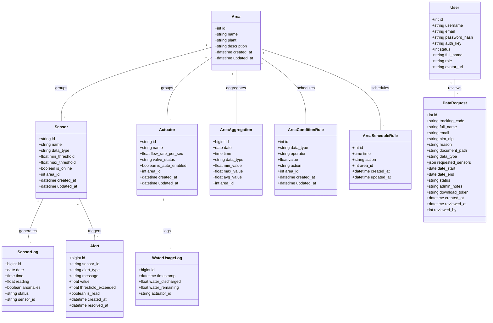
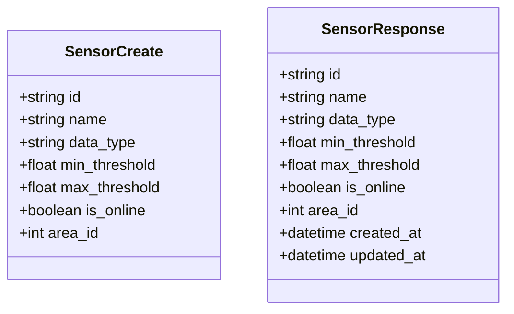

# Class Diagram - iSURF Project

Dokumen ini merinci struktur kelas internal sistem, menampilkan relasi utuh antar entitas di tingkat basis data (SQLAlchemy Models) dan penjelasan untuk masing-masing kelas.

## 1. Domain Model (SQLAlchemy Entities)

---

## 2. Penjelasan Class
Berikut adalah penjelasan fungsionalitas dari setiap kelas utama di atas:

### **`User`**
Merepresentasikan entitas pengguna dalam sistem (seperti Administrator, Operator, dan Viewer). Mengelola kredensial otentikasi (username, password hash) dan status akun.

### **`Area`**
Merepresentasikan wilayah atau sektor lahan pertanian urban pintar (misalnya "Greenhouse A", "Nursery B"). Kelas ini melacak jenis komoditas tanaman (`plant`) yang ditanam dan deskripsinya. Menjadi wadah pengelompokan bagi sensor dan aktuator.

### **`Sensor`**
Mendefinisikan modul sensor fisik (seperti sensor kelembaban tanah, suhu udara, pH, TDS) yang terpasang di wilayah (`Area`) tertentu. Kelas ini menyimpan ambang batas nilai batas atas (`max_threshold`) dan batas bawah (`min_threshold`) untuk memantau keselamatan kondisi tanaman.

### **`Actuator`**
Mendefinisikan modul aktuator/alat kontrol keluaran fisik (seperti pompa air elektrik, selenoid valve, kipas) yang terpasang pada suatu wilayah (`Area`). Melacak kapasitas aliran air per detik (`flow_rate_per_sec`) dan status katup (`valve_status`).

### **`SensorLog`**
Catatan riwayat data telemetry mentah yang dikirim oleh perangkat IoT untuk sensor tertentu. Menyimpan tanggal (`date`), waktu (`time`), nilai pembacaan (`reading`), penanda anomali (`anomalies`), dan status keselamatan pembacaan.

### **`AreaAggregation`**
Menyimpan rangkuman agregasi statistik (nilai minimum, maksimum, dan rata-rata) per wilayah (`Area`) berdasarkan tipe data tertentu untuk kebutuhan visualisasi grafik analitik yang cepat.

### **`Alert`**
Mencatat kejadian anomali saat nilai sensor keluar dari batas aman yang telah diatur pada `Sensor`. Memuat tingkat keparahan (*alert type*), pesan peringatan, nilai pemicu, dan status penanganan alert.

### **`AreaConditionRule` & `AreaScheduleRule`**
Merupakan aturan logika otomasi penyiraman dan kontrol aktuator. `AreaConditionRule` memicu aksi aktuator berdasarkan kondisi sensor (misalnya: jika Soil Moisture < 40% maka nyalakan pompa). `AreaScheduleRule` memicu aksi berdasarkan waktu terjadwal (misalnya: nyalakan pompa setiap jam 06:00).

### **`WaterUsageLog`**
Catatan penggunaan air historis dari aktifnya aktuator penyiraman. Melacak jumlah air yang dikeluarkan (`water_discharged`) dan sisa ketersediaan air pada tangki penyiraman (`water_remaining`).

### **`DataRequest`**
Formulir permohonan dataset historis yang diajukan oleh pengguna/peneliti eksternal. Melacak masa waktu data yang diminta, alasan pengajuan, file dokumen pdf bukti akademis, status persetujuan, dan token unduh data yang diulas oleh `User` (Admin).

---

## 3. API Data Transfer Objects (Pydantic Schemas)
Sistem menggunakan pola DTO (Data Transfer Object) via Pydantic untuk validasi data masukan API dan format keluaran respons JSON. Contoh representasi DTO untuk entitas **Sensor**:

---

## 4. Integrasi Router & Model
Setiap router di `apps/api/app/routers/` berinteraksi dengan **Models** melalui **Schemas/BaseModels** lokal atau global sebagai jembatan:

1.  **Request:** Payload JSON divalidasi secara otomatis menggunakan subclass Pydantic `BaseModel` (misal: `SensorCreate`).
2.  **Logic:** Data diproses dan disimpan menggunakan SQLAlchemy `Model` (anemic model) melalui session database `db`.
3.  **Response:** Objek data SQLAlchemy dikonversi menjadi skema respons JSON (misal: `SensorResponse`) yang dikembalikan ke pemanggil.
