# Sequence Diagram - iSURF Project

Dokumen ini merinci Sequence Diagram untuk masing-masing dari ke-11 Use Case dalam sistem **iSURF (Integrated Smart Urban Farming)**. Setiap diagram menggambarkan interaksi pesan antarkomponen untuk menyelaraskan pemahaman teknis dengan implementasi backend FastAPI dan database.

---

## Daftar Isi
1. [UC01: Login & Authentication](#uc01-login--authentication)
2. [UC02: Monitoring Real-time Area Data](#uc02-monitoring-real-time-area-data)
3. [UC03: Manage Areas, Sensors & Actuators](#uc03-manage-areas-sensors--actuators)
4. [UC04: Configure Sensor Thresholds](#uc04-configure-sensor-thresholds)
5. [UC05: Configure Automation Rules](#uc05-configure-automation-rules)
6. [UC06: Manual Trigger Actuator](#uc06-manual-trigger-actuator)
7. [UC07: Ingest Sensor Data](#uc07-ingest-sensor-data)
8. [UC08: Update Online Status](#uc08-update-online-status)
9. [UC09: Request Dataset](#uc09-request-dataset)
10. [UC10: Review Dataset Request](#uc10-review-dataset-request)
11. [UC11: Download Dataset](#uc11-download-dataset)

---

### UC01: Login & Authentication
Menggambarkan proses pertukaran kredensial login hingga penerbitan token otentikasi.

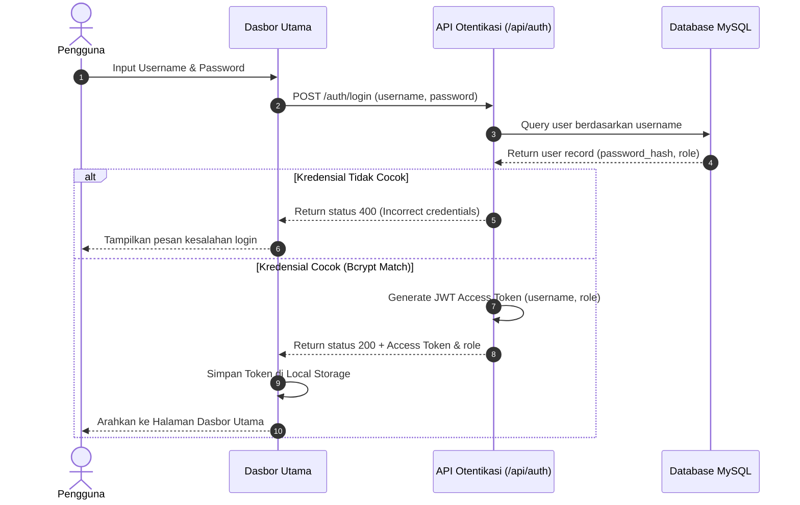

**Penjelasan:** Pengguna memasukkan username dan password. API `/auth/login` memvalidasi kredensial pengguna ke database menggunakan pencocokan hash bcrypt. Jika berhasil, sistem menerbitkan JWT token untuk authorize sesi berikutnya.

---

### UC02: Monitoring Real-time Area Data
Menggambarkan kueri telemetri wilayah secara real-time untuk visualisasi dasbor.

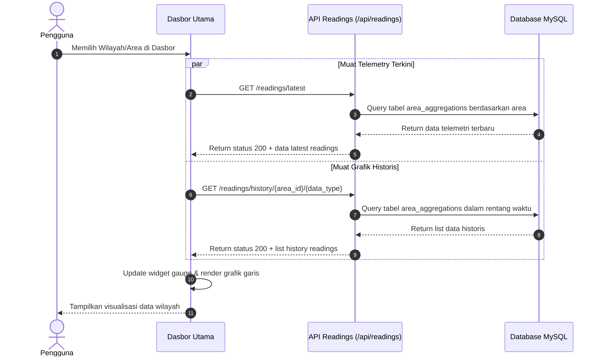

**Penjelasan:** Saat halaman wilayah dibuka, dasbor memicu dua kueri simultan ke API `/readings` untuk mengambil rangkuman status sensor terkini dan deret riwayat datanya untuk memetakan kurva tren di grafik.

---

### UC03: Manage Areas, Sensors & Actuators
Menggambarkan pendaftaran, perubahan, dan penghapusan data master wilayah, sensor, dan aktuator.

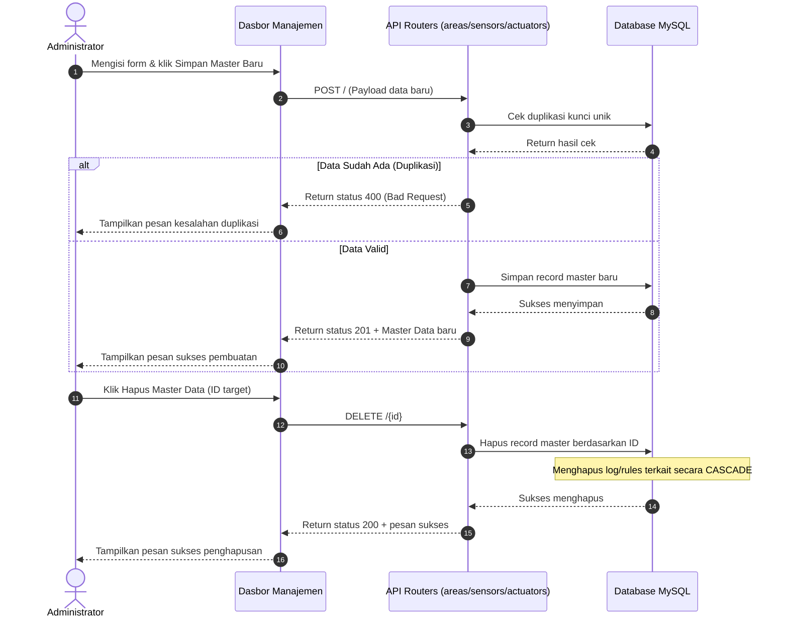

**Penjelasan:** Manajemen Master Data mencakup penambahan dan penghapusan wilayah, sensor, atau aktuator. Penghapusan data master akan membersihkan secara berantai (*cascade delete*) seluruh log transaksi dan aturan otomasi yang melekat padanya di database.

---

### UC04: Configure Sensor Thresholds
Menggambarkan pembaruan ambang batas sensor wilayah secara kolektif.

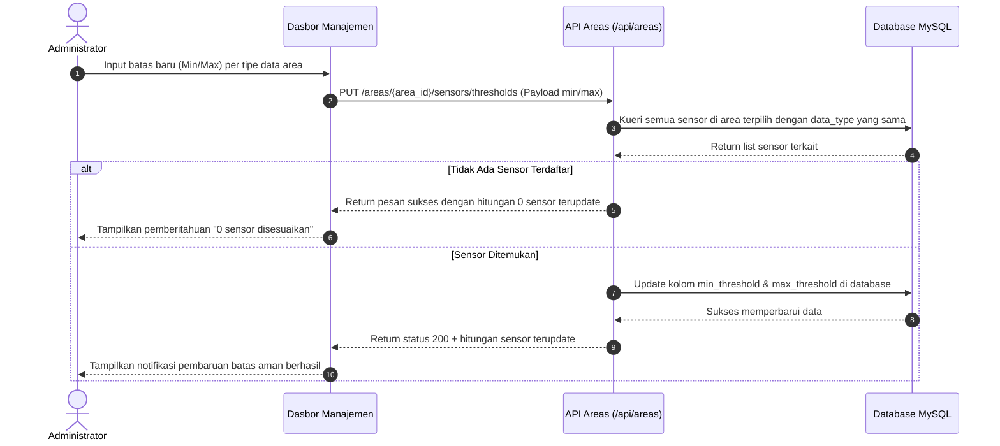

**Penjelasan:** Administrator mengubah batas aman parameter di area tertentu. API backend mengidentifikasi semua sensor yang terpengaruh dan memperbarui nilai kolom `min_threshold` dan `max_threshold` mereka secara kolektif di basis data.

---

### UC05: Configure Automation Rules
Menggambarkan penambahan aturan kontrol irigasi/aktuator otomatis.

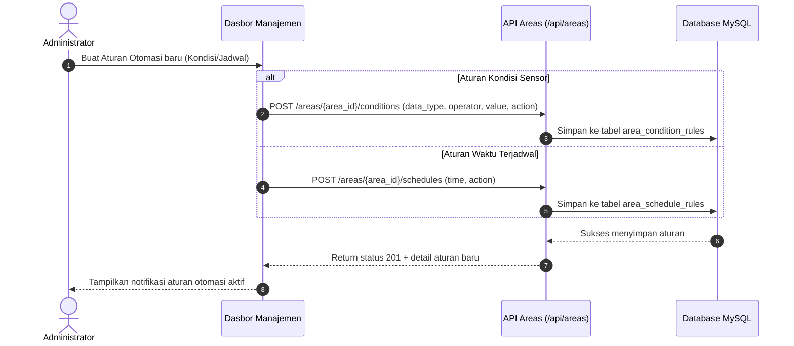

**Penjelasan:** Aturan otomasi dibuat oleh Administrator untuk mengikat aksi aktuator ke kondisi sensor atau jadwal waktu harian tertentu. Sistem menyimpan aturan ini di tabel basis data terpisah untuk dievaluasi secara berkala.

---

### UC06: Manual Trigger Actuator
Menggambarkan interaksi override paksa status aktuator pompa air irigasi.

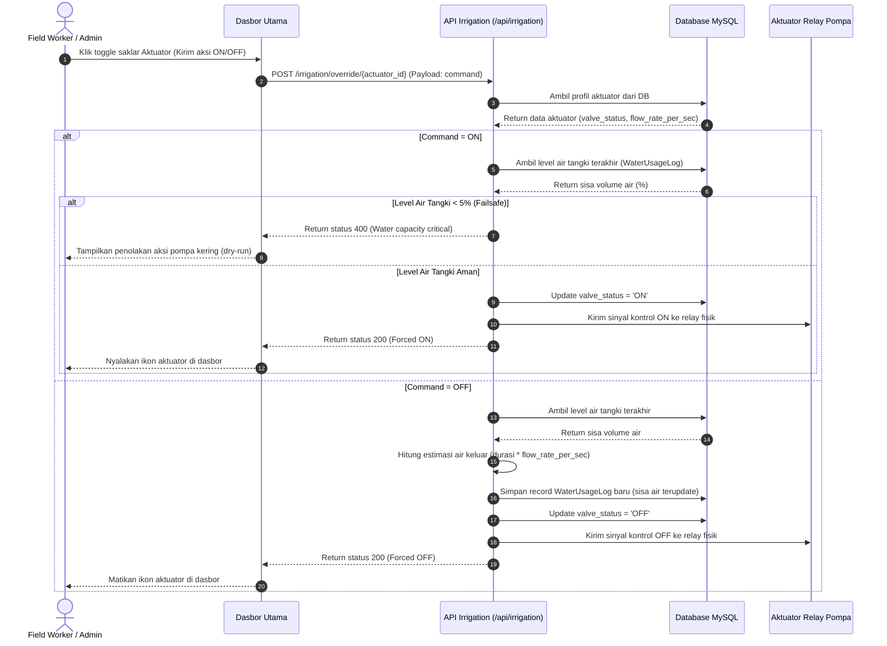

**Penjelasan:** Ketika pompa dipaksa menyala (`ON`), sistem mengaktifkan perlindungan kegagalan (*failsafe*) jika kapasitas tangki air kritis. Ketika dimatikan (`OFF`), sistem mendeteksi selang waktu aktif untuk menghitung air terpakai dan menulis data log air di tabel `water_usage_logs`.

---

### UC07: Ingest Sensor Data
Menggambarkan proses penerimaan paket telemetry telemetry sensor berkala dari ESP32.

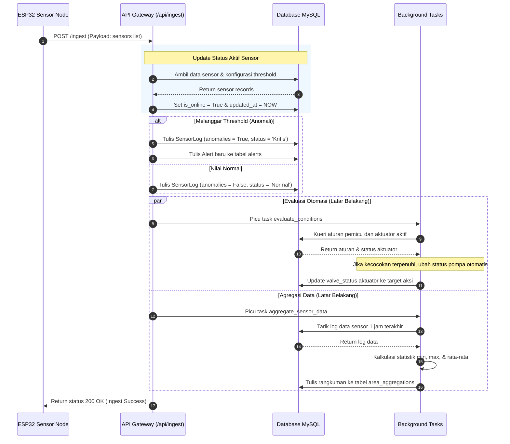

**Penjelasan:** Gateway menerima telemetri, menandai status sensor online, dan mendeteksi anomali untuk memicu peringatan darurat. Di latar belakang, sistem memicu evaluasi otomatisasi irigasi dan agregasi statistik data wilayah tanpa memblokir koneksi mikrokontroler.

---

### UC08: Update Online Status
Menggambarkan pengecekan heartbeat status konektivitas perangkat IoT secara lazy-evaluation.

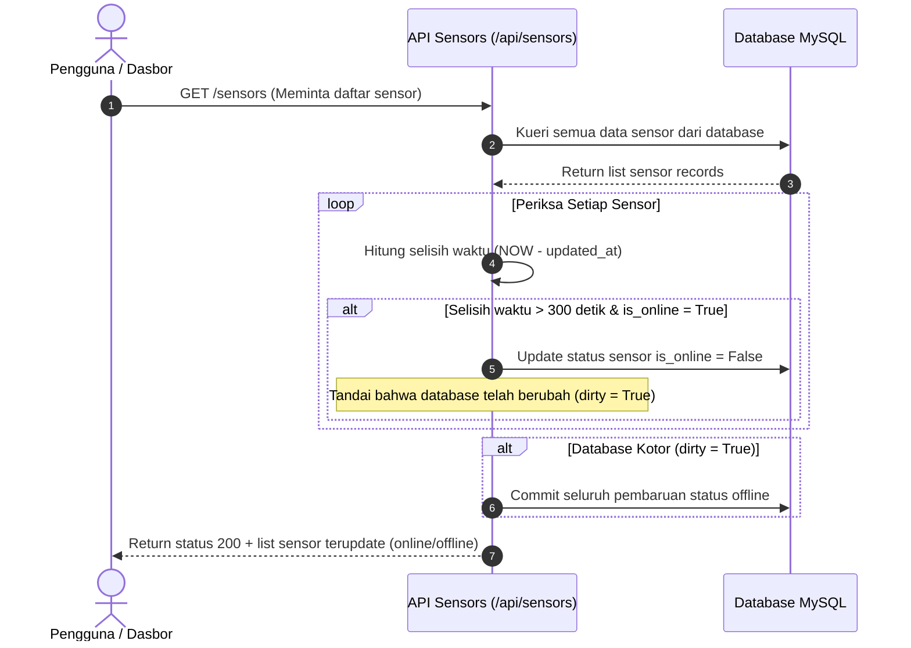

**Penjelasan:** Status keaktifan perangkat diuji setiap kali dasbor meminta data daftar sensor. Jika sensor tertentu tidak mengirimkan telemetry lebih dari 5 menit (300 detik), status koneksinya secara otomatis diubah menjadi `offline` (`is_online = False`).

---

### UC09: Request Dataset
Menggambarkan pendaftaran formulir permohonan ekspor dataset oleh peneliti.

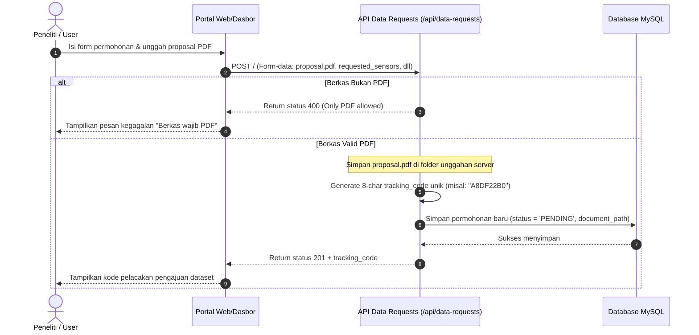

**Penjelasan:** Peneliti mengunggah proposal PDF dan mengajukan form permintaan data. Sistem menyimpan file proposal ke server, menghasilkan kode lacak unik 8 karakter acak, lalu mencatat baris pengajuan baru di tabel `data_requests` dengan status awal "PENDING".

---

### UC10: Review Dataset Request
Menggambarkan persetujuan atau penolakan permohonan dataset oleh administrator.

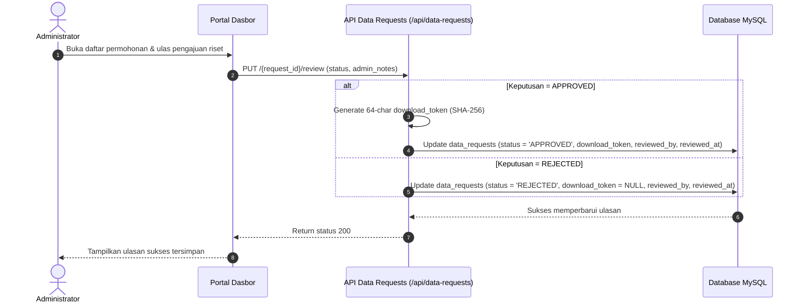

**Penjelasan:** Administrator memeriksa permohonan pengajuan data. Jika disetujui (**APPROVED**), sistem menghasilkan kunci token unduh aman (`download_token`) menggunakan SHA-256. Jika ditolak (**REJECTED**), status diubah tanpa menghasilkan token unduh.

---

### UC11: Download Dataset
Menggambarkan pengunduhan file ekspor telemetri historis menggunakan token akses disetujui.

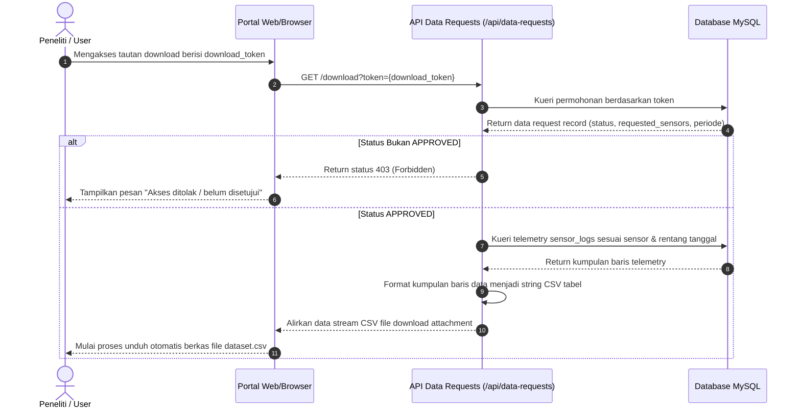

**Penjelasan:** Peneliti mengunduh data riset menggunakan token keamanan. Sistem memeriksa token di database. Jika pengajuan berstatus disetujui, sistem menarik log telemetri sensor terkait pada rentang tanggal pengajuan, mengonversinya menjadi file CSV, lalu mengirimkannya sebagai file unduhan langsung ke browser peneliti.
