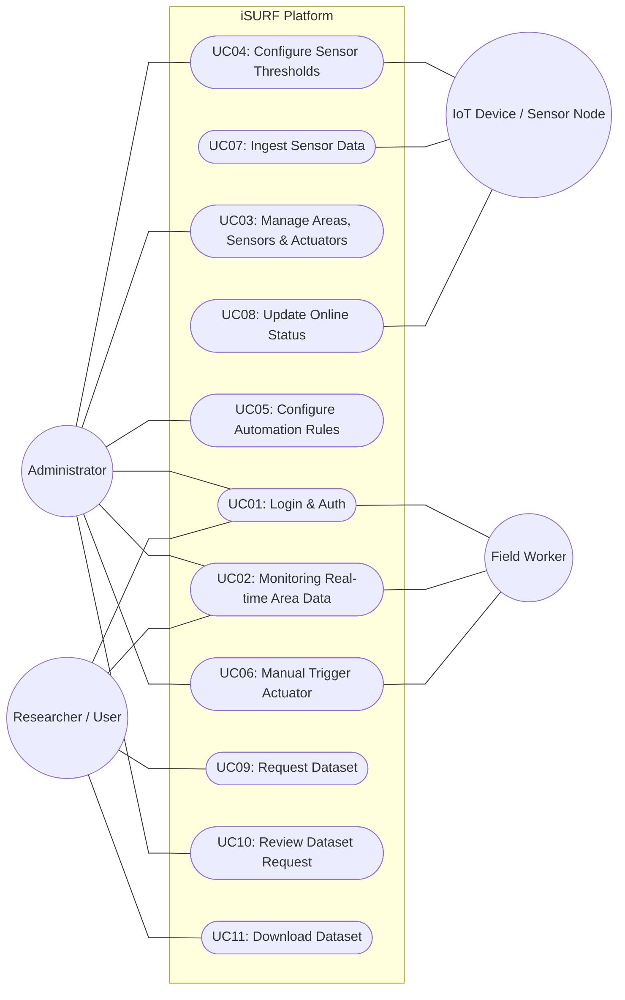

# Use Case Diagram - iSURF Project

Dokumen ini mendefinisikan interaksi antara aktor luar dengan fungsionalitas sistem **iSURF (Integrated Smart Urban Farming)**.

## 1. Diagram Use Case Utama
Berikut adalah visualisasi use case sistem menggunakan sintaks Mermaid dengan urutan yang dioptimalkan untuk meminimalkan tumpang tindih garis, diselaraskan dengan pendekatan *Area-Centric*:

---

## 2. Definisi Aktor
| Aktor | Deskripsi |
| :--- | :--- |
| **Administrator** | Memiliki akses penuh untuk mengelola pengguna, area pertanian, sensor, aktuator, serta meninjau permohonan akses data. |
| **Researcher / User** | Pengguna yang fokus pada konsumsi data historis untuk kebutuhan riset, serta pemantauan umum. |
| **Field Worker** | Personel lapangan yang memantau kondisi sensor secara mobile dan dapat melakukan override manual aktuator (pompa). |
| **IoT Device / Sensor Node** | Mikrokontroler lapangan (seperti ESP32) yang mengirimkan data telemetry dan memantau kondisi *online/offline*. |

---

## 3. Daftar Use Case
Dokumentasi detail (Sequence & Activity Diagram) dipisahkan per Use Case:

### Group A: Authentication & User Management
- **UC01: Login & Authentication:** Proses masuk ke sistem menggunakan username dan password untuk mendapat token akses.

### Group B: Area & Monitoring
- **UC02: Monitoring Real-time Area Data:** Memantau telemetry sensor (kelembaban tanah, suhu udara, pH, TDS) berdasarkan area pertanian.
- **UC07: Ingest Sensor Data:** Proses pengiriman otomatis dari IoT Device ke endpoint `/ingest` API backend.
- **UC08: Update Online Status:** Perubahan status aktif sensor (`is_online`) berdasarkan *heartbeat* aktivitas pengiriman data terakhir.

### Group C: Control & Configuration
- **UC03: Manage Areas, Sensors & Actuators:** Penambahan, pembaruan, dan penghapusan wilayah (Area) serta sensor dan aktuator yang terikat padanya.
- **UC04: Configure Sensor Thresholds:** Pengaturan ambang batas atas dan batas bawah pembacaan sensor untuk trigger alert anomali.
- **UC05: Configure Automation Rules:** Pengaturan otomasi pompa/aktuator berdasarkan jadwal harian (`AreaScheduleRule`) atau pembacaan kondisi sensor (`AreaConditionRule`).
- **UC06: Manual Trigger Actuator:** Melakukan override paksa status aktuator (pompa 'ON' atau 'OFF') melalui perintah API/Dashboard.

### Group D: Research Data Access
- **UC09: Request Dataset:** Mengajukan formulir permohonan unduh dataset telemetry historis dengan menyertakan berkas pdf proposal/izin.
- **UC10: Review Dataset Request:** Validasi permohonan data oleh Administrator (Approved/Rejected).
- **UC11: Download Dataset:** Melakukan unduh berkas data ekspor dalam format CSV/JSON setelah mendapat token unduh yang disetujui.

---

## 4. Deskripsi Detail Use Case (Detailed Descriptions)

### **UC01: Login & Authentication**
| Field | Value |
| :--- | :--- |
| **Use Case Name** | Login & Authentication |
| **Scenario** | Pengguna masuk log ke dalam platform dasbor iSURF. |
| **Triggering Event** | Pengguna ingin mengakses fitur dasbor iSURF. |
| **Brief Description** | Sistem memvalidasi kredensial pengguna dan menerbitkan token akses untuk otentikasi sesi dasbor sesuai perannya. |
| **Actor** | Administrator, Field Worker, Researcher |
| **Related Use Case(s)** | - |
| **Stakeholders** | Pengguna, Sistem Keamanan |
| **Precondition(s)** | Pengguna memiliki akun terdaftar. |
| **Postcondition(s)** | Pengguna diarahkan ke dasbor dengan token sesi aktif. |
| **Flow of Activities** | **Actor**: 1. Memasukkan Username dan Password. **System**: 2. Memvalidasi format masukan. **System**: 3. Mencari data pengguna di database. **Actor**: 4. Menyerahkan formulir login. **System**: 5. Memverifikasi hash sandi. **System**: 6. Menerbitkan JWT Access Token dan mengarahkan ke dasbor sesuai peran. |
| **Exception Condition** | 1. Jika format masukan salah, sistem menampilkan error validasi. 2. Jika nama pengguna tidak ditemukan atau sandi salah, sistem menampilkan pesan "Kredensial Salah". |

---

### **UC02: Monitoring Real-time Area Data**
| Field | Value |
| :--- | :--- |
| **Use Case Name** | Monitoring Real-time Area Data |
| **Scenario** | Pengguna memantau metrik sensor dan grafik riwayat area secara langsung. |
| **Triggering Event** | Pengguna ingin melihat kondisi terkini wilayah pertanian. |
| **Brief Description** | Sistem menyajikan metrik gauge data sensor terbaru dan grafik historis untuk wilayah pertanian yang dipilih. |
| **Actor** | Administrator, Field Worker, Researcher |
| **Related Use Case(s)** | - |
| **Stakeholders** | Pengguna, Pengelola Lahan |
| **Precondition(s)** | Pengguna sudah login ke dalam sistem. |
| **Postcondition(s)** | Pengguna mendapatkan visualisasi data telemetry area secara terkini. |
| **Flow of Activities** | **Actor**: 1. Membuka halaman Monitoring. **System**: 2. Memuat daftar area terdaftar dari database. **Actor**: 3. Memilih area tertentu. **System**: 4. Mengambil data sensor terbaru dan log agregasi historis area tersebut. **System**: 5. Menampilkan nilai metrik terkini dan kurva tren grafik. |
| **Exception Condition** | 1. Jika koneksi terputus, dasbor menampilkan pesan kesalahan jaringan. 2. Jika data log sensor di area tersebut kosong, sistem menampilkan status "Tidak ada telemetry". |

---

### **UC03: Manage Areas, Sensors & Actuators**
| Field | Value |
| :--- | :--- |
| **Use Case Name** | Manage Areas, Sensors & Actuators |
| **Scenario** | Administrator menambah, mengubah, atau menghapus master area, sensor, atau aktuator. |
| **Triggering Event** | Administrator ingin melakukan pembaruan master inventaris sistem di lapangan. |
| **Brief Description** | Sistem mengelola entitas master wilayah serta perangkat keras sensor/aktuator terkait untuk referensi data operasional. |
| **Actor** | Administrator |
| **Related Use Case(s)** | - |
| **Stakeholders** | Administrator, Pengelola Lapangan |
| **Precondition(s)** | Administrator sudah masuk log dengan hak akses admin. |
| **Postcondition(s)** | Data master diperbarui pada basis data secara permanen. |
| **Flow of Activities** | **Actor**: 1. Memilih opsi tambah/ubah/hapus area, sensor, atau aktuator. **Actor**: 2. Mengisi formulir data atau memilih ID target. **System**: 3. Memvalidasi ketersediaan dan keunikan kunci data di basis data. **System**: 4. Menyimpan data baru atau menerapkan perubahan kolom. **System**: 5. Melakukan penghapusan secara berantai (cascade delete) log jika aksi berupa hapus. **System**: 6. Menampilkan notifikasi sukses perubahan data. |
| **Exception Condition** | 1. Jika data duplikat, sistem menampilkan pesan kesalahan input. 2. Jika data target tidak ditemukan saat ubah/hapus, sistem mengembalikan notifikasi kesalahan. |

---

### **UC04: Configure Sensor Thresholds**
| Field | Value |
| :--- | :--- |
| **Use Case Name** | Configure Sensor Thresholds |
| **Scenario** | Administrator menyesuaikan rentang nilai batas aman untuk sensor wilayah. |
| **Triggering Event** | Terjadi perubahan batas keselamatan komoditas tanaman di suatu Greenhouse. |
| **Brief Description** | Sistem memperbarui ambang batas bawah dan batas atas sensor sejenis secara kolektif pada suatu area wilayah. |
| **Actor** | Administrator |
| **Related Use Case(s)** | - |
| **Stakeholders** | Administrator, Sistem Otomasi |
| **Precondition(s)** | Administrator telah masuk log. |
| **Postcondition(s)** | Nilai konfigurasi ambang batas sensor di area terkait diperbarui. |
| **Flow of Activities** | **Actor**: 1. Mengakses panel threshold area. **Actor**: 2. Memasukkan nilai batas bawah (min) dan batas atas (max) baru untuk jenis sensor terpilih. **System**: 3. Mengidentifikasi semua sensor yang terpengaruh di wilayah tersebut. **System**: 4. Memperbarui parameter `min_threshold` dan `max_threshold` sensor di basis data. **System**: 5. Menampilkan pesan konfirmasi beserta jumlah sensor yang disesuaikan. |
| **Exception Condition** | 1. Jika input bukan angka, sistem membatalkan proses dan meminta perbaikan nilai input. |

---

### **UC05: Configure Automation Rules**
| Field | Value |
| :--- | :--- |
| **Use Case Name** | Configure Automation Rules |
| **Scenario** | Administrator mendaftarkan pemicu otomasi aktuator berbasis kondisi atau jadwal. |
| **Triggering Event** | Administrator ingin mengatur kontrol penyiraman air otomatis. |
| **Brief Description** | Sistem menyimpan aturan pemicu berbasis waktu harian atau nilai batas sensor untuk mengontrol aktifnya katup/pompa air. |
| **Actor** | Administrator |
| **Related Use Case(s)** | - |
| **Stakeholders** | Administrator, Node Aktuator |
| **Precondition(s)** | Administrator sudah masuk log. |
| **Postcondition(s)** | Aturan otomatisasi tersimpan aktif pada database. |
| **Flow of Activities** | **Actor**: 1. Memilih tipe aturan (kondisi sensor atau jadwal harian). **Actor**: 2. Memasukkan parameter aturan (waktu eksekusi atau nilai batas sensor, operator, dan aksi alat). **System**: 3. Menyimpan aturan ke dalam tabel basis data aturan wilayah. **System**: 4. Tugas latar belakang (*background task*) membaca aturan untuk mengevaluasi data berkala. **System**: 5. Menampilkan pesan berhasil pendaftaran aturan. |
| **Exception Condition** | 1. Jika parameter aturan bertentangan atau tidak lengkap, sistem menampilkan peringatan. |

---

### **UC06: Manual Trigger Actuator**
| Field | Value |
| :--- | :--- |
| **Use Case Name** | Manual Trigger Actuator |
| **Scenario** | Pengguna memaksa mengontrol saklar status aktuator irigasi. |
| **Triggering Event** | Pengguna ingin menyiram area secara manual di luar jadwal otomatisasi. |
| **Brief Description** | Sistem memvalidasi kapasitas tangki air terlebih dahulu sebelum mengirimkan perintah aktifkan/matikan hardware pompa air fisik. |
| **Actor** | Field Worker, Administrator |
| **Related Use Case(s)** | - |
| **Stakeholders** | Pengguna, Perangkat Aktuator |
| **Precondition(s)** | Pengguna sudah masuk log dan aktuator terdaftar. |
| **Postcondition(s)** | Status fisik aktuator berubah dan log volume air terpakai tersimpan. |
| **Flow of Activities** | **Actor**: 1. Memilih opsi aktuator di dasbor. **Actor**: 2. Menekan tombol toggle ON/OFF aktuator. **System**: 3. Jika perintah berupa ON: Memeriksa ketersediaan tangki air. Jika cukup, kirim sinyal relay ON ke hardware dan set status ON di DB. **System**: 4. Jika perintah berupa OFF: Hitung durasi aktif, estimasi air keluar, simpan WaterUsageLog, kirim sinyal relay OFF ke hardware, dan set status OFF di DB. |
| **Exception Condition** | 1. Jika level air tangki di bawah 5%, sistem membatalkan perintah ON (failsafe) dan memberikan peringatan "Kapasitas air kritis". |

---

### **UC07: Ingest Sensor Data**
| Field | Value |
| :--- | :--- |
| **Use Case Name** | Ingest Sensor Data |
| **Scenario** | Node sensor fisik mengirimkan paket telemetry data sensor secara berkala. |
| **Triggering Event** | Interval waktu pengiriman data pada mikrokontroler IoT tercapai. |
| **Brief Description** | Sistem menerima paket data telemetry, memperbarui status online sensor, mendeteksi anomali batas aman, serta memicu tugas latar belakang evaluasi otomasi. |
| **Actor** | IoT Device / Sensor Node |
| **Related Use Case(s)** | - |
| **Stakeholders** | Pengelola Pertanian, Sistem Otomasi |
| **Precondition(s)** | Perangkat IoT memiliki kredensial API yang valid. |
| **Postcondition(s)** | Telemetry tersimpan di tabel log dan alert dipicu jika terdeteksi anomali. |
| **Flow of Activities** | **Actor (IoT)**: 1. Mengirim paket telemetry data sensor. **System**: 2. Menandai status koneksi sensor online dan memperbarui waktu kontak. **System**: 3. Membandingkan nilai dengan threshold sensor. **System**: 4. Jika normal, simpan log normal. Jika anomali, simpan log kritis dan buat alert baru. **System**: 5. Memulai Background Task evaluasi kondisi otomasi. **System**: 6. Memulai Background Task agregasi statistik per jam wilayah. |
| **Exception Condition** | 1. Jika format JSON rusak, sistem membatalkan proses dan mengembalikan kode kesalahan validasi payload. |

---

### **UC08: Update Online Status**
| Field | Value |
| :--- | :--- |
| **Use Case Name** | Update Online Status |
| **Scenario** | Sistem memeriksa konektivitas seluruh sensor untuk memantau status aktif. |
| **Triggering Event** | Permintaan data sensor (GET /sensors) dipicu oleh dasbor. |
| **Brief Description** | Sistem memantau selisih waktu telemetri terakhir sensor dan secara otomatis menandai sensor sebagai offline jika melewati batas toleransi waktu. |
| **Actor** | IoT Device / Sensor Node (Aktor Pasif) |
| **Related Use Case(s)** | UC07: Ingest Sensor Data |
| **Stakeholders** | Administrator, Pemantau Sistem |
| **Precondition(s)** | - |
| **Postcondition(s)** | Status konektivitas sensor online/offline diperbarui di basis data. |
| **Flow of Activities** | **System**: 1. Dasbor meminta daftar sensor. **System**: 2. Membaca waktu kontak terakhir seluruh sensor. **System**: 3. Menghitung selisih waktu saat ini dengan waktu kontak terakhir. **System**: 4. Jika selisih waktu > 300 detik (5 menit), perbarui status sensor menjadi offline di basis data. **System**: 5. Mengirimkan data sensor dengan status online/offline terbaru ke dasbor. |
| **Exception Condition** | - |

---

### **UC09: Request Dataset**
| Field | Value |
| :--- | :--- |
| **Use Case Name** | Request Dataset |
| **Scenario** | Peneliti mengajukan permohonan akses ekspor dataset historis telemetry. |
| **Triggering Event** | Peneliti memerlukan data telemetry untuk analisis atau riset akademis. |
| **Brief Description** | Sistem memvalidasi dokumen proposal PDF, menghasilkan kode pelacakan pengajuan, dan menyimpan permohonan dengan status pending. |
| **Actor** | Researcher / User |
| **Related Use Case(s)** | - |
| **Stakeholders** | Peneliti, Administrator |
| **Precondition(s)** | Peneliti sudah masuk log ke dalam portal web. |
| **Postcondition(s)** | Berkas pengajuan terdaftar di database dengan status "PENDING". |
| **Flow of Activities** | **Actor**: 1. Mengisi formulir permohonan data. **Actor**: 2. Mengunggah dokumen pendukung proposal (format PDF). **System**: 3. Memvalidasi ekstensi berkas (.pdf). **System**: 4. Menyimpan berkas proposal secara lokal di penyimpanan server. **System**: 5. Menghasilkan kode pelacakan pengajuan acak 8 karakter. **System**: 6. Menyimpan pengajuan status pending ke database dan menampilkan kode pelacakan. |
| **Exception Condition** | 1. Jika berkas bukan PDF, sistem menampilkan notifikasi kesalahan penolakan jenis berkas. |

---

### **UC10: Review Dataset Request**
| Field | Value |
| :--- | :--- |
| **Use Case Name** | Review Dataset Request |
| **Scenario** | Administrator meninjau dan memberikan ulasan keputusan pengajuan data. |
| **Triggering Event** | Terdapat pengajuan izin data masuk berstatus PENDING di sistem. |
| **Brief Description** | Sistem mencatat keputusan ulasan admin (Approved/Rejected) dan menerbitkan token unduh rahasia jika disetujui. |
| **Actor** | Administrator |
| **Related Use Case(s)** | UC09: Request Dataset |
| **Stakeholders** | Administrator, Peneliti |
| **Precondition(s)** | Administrator telah masuk log. |
| **Postcondition(s)** | Pengajuan berstatus APPROVED (beserta token unduh) atau REJECTED. |
| **Flow of Activities** | **Actor**: 1. Membuka detail permohonan pending. **Actor**: 2. Menentukan ulasan (Setuju/Tolak) dan menulis catatan ulasan. **System**: 3. Jika disetujui: Generate token unduh rahasia 64 karakter (SHA-256) dan simpan ulasan disetujui di DB. **System**: 4. Jika ditolak: Set status ditolak tanpa token di DB. **System**: 5. Menampilkan notifikasi sukses ulasan tersimpan. |
| **Exception Condition** | 1. Jika ID permohonan tidak ditemukan, sistem mengembalikan notifikasi kesalahan. |

---

### **UC11: Download Dataset**
| Field | Value |
| :--- | :--- |
| **Use Case Name** | Download Dataset |
| **Scenario** | Peneliti mengunduh berkas file telemetry historis menggunakan token akses. |
| **Triggering Event** | Peneliti ingin mengambil file dataset setelah disetujui admin. |
| **Brief Description** | Sistem memverifikasi token unduh, menarik log telemetry sensor periode terkait, memformat data ke CSV, dan mengalirkannya sebagai file unduh. |
| **Actor** | Researcher / User |
| **Related Use Case(s)** | UC10: Review Dataset Request |
| **Stakeholders** | Peneliti |
| **Precondition(s)** | Peneliti memiliki token unduhan yang aktif dan disetujui (APPROVED). |
| **Postcondition(s)** | Berkas telemetry tersalurkan sukses dan terunduh otomatis ke komputer peneliti. |
| **Flow of Activities** | **Actor**: 1. Mengakses link unduhan menggunakan token akses. **System**: 2. Memverifikasi validitas token pengajuan di basis data. **System**: 3. Jika tidak valid/belum disetujui: Batalkan dan kembalikan akses ditolak. **System**: 4. Jika valid: Tarik sensor log sesuai sensor dan rentang tanggal permohonan. **System**: 5. Format baris telemetry menjadi file stream CSV. **System**: 6. Kirim data sebagai file download attachment ke pemohon. |
| **Exception Condition** | 1. Jika data log kosong pada periode tersebut, kembalikan kesalahan "Data tidak ditemukan". |
