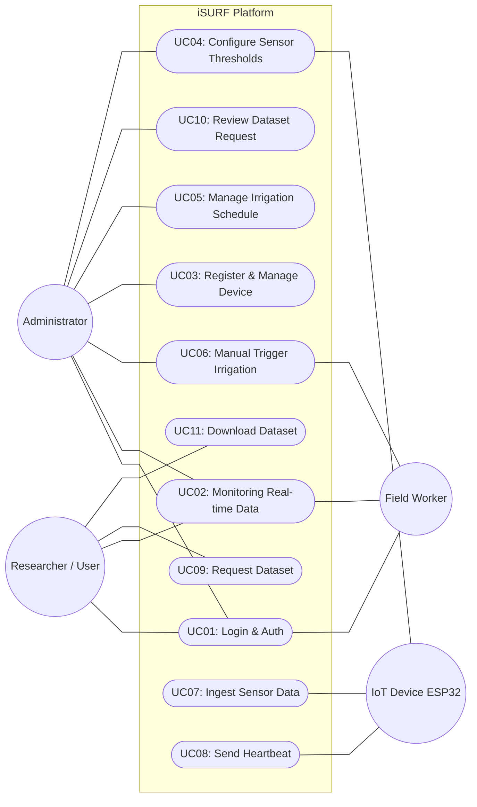

# Use Case Diagram - iSURF Project

Dokumen ini mendefinisikan interaksi antara aktor luar dengan fungsionalitas sistem **iSURF (Integrated Smart Urban Farming)**.

## 1. Diagram Use Case Utama
Berikut adalah visualisasi use case sistem menggunakan sintaks Mermaid dengan urutan yang dioptimalkan untuk meminimalkan tumpang tindih garis:

---

## 2. Definisi Aktor
| Aktor | Deskripsi |
| :--- | :--- |
| **Administrator** | Memiliki akses penuh untuk mengelola pengguna, perangkat IoT, dan melakukan audit terhadap permintaan data. |
| **Researcher / User** | Pengguna yang fokus pada konsumsi data untuk penelitian atau pemantauan umum. |
| **Field Worker** | Personel di lapangan yang memantau sistem melalui aplikasi mobile dan melakukan tindakan manual jika diperlukan. |
| **IoT Device** | Perangkat keras (ESP32) yang berinteraksi dengan API for mengirim data telemetri. |

---

## 3. Daftar Use Case
Dokumentasi detail (Sequence & Activity Diagram) akan dipisahkan per Use Case:

### Group A: Authentication & User Management
- **UC01: Login & Authentication:** Proses masuk ke sistem menggunakan username dan password untuk mendapatkan akses via Web/Mobile.

### Group B: Device & Monitoring
- **UC02: Monitoring Real-time Data:** Melihat data sensor (pH, TDS, Temp, dll) secara langsung melalui dashboard.
- **UC07: Ingest Sensor Data:** Proses otomatis perangkat IoT mengirimkan pembacaan sensor ke server.
- **UC08: Send Heartbeat:** Perangkat IoT melaporkan status aktif secara periodik.

### Group C: Control & Configuration
- **UC03: Register & Manage Device:** Menambahkan perangkat baru ke sistem (oleh Admin).
- **UC04: Configure Sensor Thresholds:** Mengatur batas aman nilai sensor untuk memicu peringatan otomatis.
- **UC05: Manage Irrigation Schedule:** Penjadwalan penyiraman otomatis berdasarkan waktu.
- **UC06: Manual Trigger Irrigation:** Menyalakan pompa/actuator secara langsung dari aplikasi.

### Group D: Research Data Access
- **UC09: Request Dataset:** Mengajukan permohonan data historis dalam rentang waktu tertentu.
- **UC10: Review Dataset Request:** Validasi permohonan data oleh Administrator.
- **UC11: Download Dataset:** Mengunduh file data yang telah disetujui (CSV/JSON).
