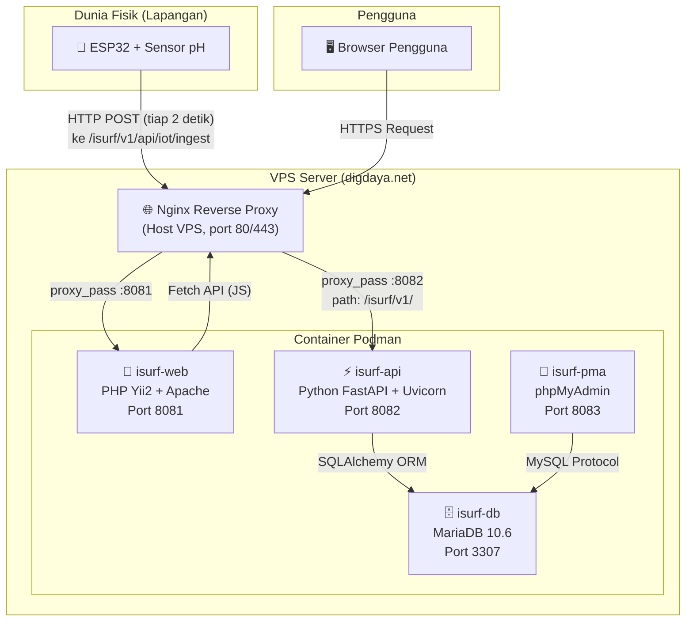
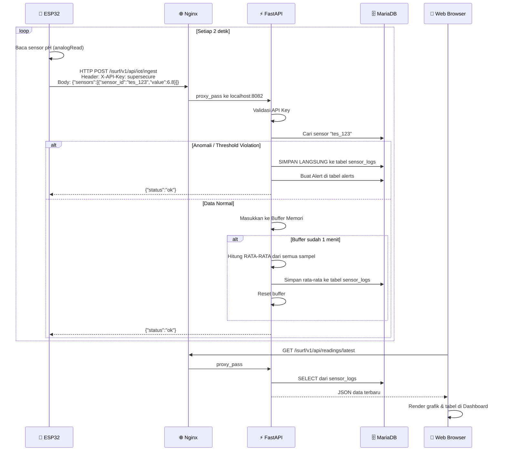

# Dokumentasi Lengkap: Proses Deployment & Integrasi IoT — iSURF

---

## 1. Gambaran Arsitektur Sistem

Sistem iSURF terdiri dari **4 komponen utama** yang saling terhubung melalui jaringan internet:



### Penjelasan Setiap Komponen

| Komponen | Teknologi | Fungsi | Port |
|---|---|---|---|
| **Nginx** | Nginx (di Host VPS) | Reverse Proxy & SSL Termination. Menerima semua trafik masuk dari internet dan meneruskannya ke container yang tepat. | `80` / `443` |
| **isurf-web** | PHP 8.2, Apache, Yii2 Framework | Menghidangkan halaman web (Dashboard, Monitoring, Kontrol Area, dll.) ke browser pengguna. | `8081` |
| **isurf-api** | Python 3.11, FastAPI, Uvicorn | Menyediakan REST API untuk menerima data sensor, mengelola aktuator, otomatisasi, autentikasi, dan semua logika bisnis. | `8082` |
| **isurf-db** | MariaDB 10.6 | Menyimpan semua data (sensor, aktuator, log, pengguna, aturan otomatisasi, dll.). | `3307` (hanya lokal) |
| **isurf-pma** | phpMyAdmin | Antarmuka web untuk mengelola database secara visual (debugging). | `8083` |

---

## 2. Struktur File Proyek yang Relevan

```
ilkom-isurf-project/
├── apps/
│   ├── api/                          # Backend FastAPI
│   │   ├── app/
│   │   │   ├── main.py               # Entry point API, routing
│   │   │   ├── config.py             # Konfigurasi (baca .env)
│   │   │   ├── database.py           # Koneksi SQLAlchemy ke MariaDB
│   │   │   ├── models/               # Model database (ORM)
│   │   │   ├── routers/              # Endpoint API
│   │   │   │   ├── iot_gateway.py    # Endpoint /ingest (terima data IoT)
│   │   │   │   ├── actuators.py      # CRUD aktuator
│   │   │   │   ├── sensors.py        # CRUD sensor
│   │   │   │   └── ...
│   │   │   └── utils/                # Logika otomatisasi & agregasi
│   │   ├── .env                      # Variabel lingkungan (DATABASE_URL, SECRET_KEY)
│   │   ├── Dockerfile                # Resep build container API
│   │   └── requirements.txt          # Daftar pustaka Python
│   │
│   ├── web/                          # Frontend Yii2
│   │   ├── frontend/
│   │   │   ├── views/site/           # Halaman-halaman web (.php)
│   │   │   └── web/js/isurf-api.js   # Library JS untuk panggil API
│   │   └── Dockerfile                # Resep build container Web
│   │
│   └── iot_node/                     # Kode perangkat keras
│       └── esp32_ph_sensor/
│           └── esp32_ph_sensor.ino   # Program C++ untuk ESP32
│
└── infra/
    └── deployment/
        ├── podman-compose.yml        # Orkestrasi semua container
        └── nginx.conf                # Template konfigurasi Nginx
```

---

## 3. Proses Deployment (Langkah demi Langkah)

### 3.1. Prasyarat di VPS

VPS Anda (server kampus `digdaya.net`) harus sudah memiliki:
- **Sistem Operasi:** Linux (Ubuntu/Debian)
- **Podman** (atau Docker) + `podman-compose` terinstal
- **Nginx** terinstal di level host (bukan di dalam container)
- **Akses SSH:** `ssh podman@ssh.digdaya.net`

### 3.2. Deploy Pertama Kali (Fresh Install)

> [!NOTE]
> Langkah ini hanya dilakukan **sekali** di awal. Setelah itu, Anda hanya perlu mengikuti Langkah 3.3 untuk pembaruan.

**A. Clone Repository ke VPS:**
```bash
ssh podman@ssh.digdaya.net
git clone https://github.com/giivari/isurf_project_2026_clone.git
cd isurf_project_2026_clone
```

**B. Bangun & Jalankan Semua Container:**
```bash
cd infra/deployment
sudo podman-compose up -d --build
```

Perintah ini akan:
1. Mengunduh *image* MariaDB 10.6 dan phpMyAdmin dari Docker Hub.
2. Membangun (*build*) image `isurf-api` dari `apps/api/Dockerfile`.
3. Membangun (*build*) image `isurf-web` dari `apps/web/Dockerfile`.
4. Menjalankan ke-4 container secara bersamaan di *background* (`-d`).

**C. Konfigurasi Nginx Reverse Proxy:**
Salin template konfigurasi Nginx ke dalam direktori Nginx di host:
```bash
sudo cp infra/deployment/nginx.conf /etc/nginx/sites-available/isurf.digdaya.net.conf
sudo ln -s /etc/nginx/sites-available/isurf.digdaya.net.conf /etc/nginx/sites-enabled/
sudo nginx -t        # Tes apakah konfigurasi valid
sudo systemctl reload nginx
```

> [!IMPORTANT]
> Pada kasus Anda, **SSL/HTTPS dikelola oleh infrastruktur kampus (dosen)** secara terpusat. Anda tidak perlu menjalankan Certbot. Sertifikat SSL sudah otomatis diterapkan oleh sistem Load Balancer kampus.

### 3.3. Deploy Pembaruan (Update File Satuan)

Setelah sistem berjalan, Anda **tidak perlu rebuild seluruh container** untuk perubahan kecil. Cukup salin file yang berubah langsung ke dalam container yang sedang berjalan.

**Untuk file Backend (Python API):**
```powershell
# Dari PowerShell lokal Anda:
cd C:\Users\givar\KULIAH\capstone\ilkom-isurf-project
scp apps\api\app\routers\iot_gateway.py podman@ssh.digdaya.net:/tmp/iot_gateway.py
```
```bash
# Di terminal SSH VPS:
sudo podman cp /tmp/iot_gateway.py isurf-api:/app/app/routers/iot_gateway.py
sudo podman restart isurf-api   # WAJIB restart karena Python perlu reload
```

**Untuk file Frontend (PHP/JS):**
```powershell
# Dari PowerShell lokal:
scp apps\web\frontend\views\site\areas.php podman@ssh.digdaya.net:/tmp/areas.php
```
```bash
# Di terminal SSH VPS:
sudo podman cp /tmp/areas.php isurf-web:/var/www/html/frontend/views/site/areas.php
# TIDAK perlu restart container (PHP langsung membaca file terbaru)
```

> [!TIP]
> **Kapan harus restart container?**
> - Perubahan file **Python (.py)**: Wajib `sudo podman restart isurf-api`
> - Perubahan file **PHP (.php) / JS (.js)**: Tidak perlu restart
> - Perubahan file **Dockerfile / requirements.txt**: Harus rebuild (`sudo podman-compose up -d --build`)

---

## 4. Alur Data: Dari Sensor Fisik ke Dashboard Web

Berikut adalah perjalanan data yang terjadi setiap 2 detik saat alat ESP32 menyala:



### Penjelasan Alur Buffer Server-Side

| Langkah | Waktu | Aksi |
|---|---|---|
| 1. ESP32 membaca sensor | Tiap **2 detik** | Nilai pH mentah dikirim ke server via HTTP POST |
| 2. Server menerima data | Langsung | Cek anomali (pH < 0 atau > 14) dan threshold violation |
| 3a. Jika **Anomali/Threshold** | **Instan** | Data langsung disimpan ke database + alert dibuat |
| 3b. Jika **Normal** | Di-buffer | Data ditampung di memori server (RAM) |
| 4. Setelah **1 menit** | Otomatis | Server menghitung rata-rata semua sampel buffer, lalu menyimpan 1 baris ke database |

> [!WARNING]
> Buffer disimpan di **RAM server** (in-memory), bukan di database. Jika container `isurf-api` di-restart, buffer yang belum ter-flush akan hilang. Ini bukan masalah besar karena kehilangan maksimal hanya data 1 menit terakhir.

---

## 5. Integrasi Alat IoT (ESP32)

### 5.1. Konfigurasi di Sisi Web (Dashboard)

Sebelum alat bisa mengirim data, Anda harus **mendaftarkan sensor** terlebih dahulu di Dashboard Web:
1. Buka `https://isurf.digdaya.net` → Login.
2. Navigasi ke **Kontrol Area** → Pilih/buat sebuah Area.
3. Klik **+ Tambah Sensor** → Isi:
   - **ID Sensor:** `tes_123` *(harus sama persis dengan yang ada di kode ESP32)*
   - **Nama:** `Sensor pH Air`
   - **Tipe Data:** `pH`
   - **Min Threshold:** `1` *(batas bawah alert)*
   - **Max Threshold:** `14` *(batas atas alert)*
4. Simpan.

### 5.2. Konfigurasi di Sisi Alat (ESP32)

Buka file [esp32_ph_sensor.ino](file:///c:/Users/givar/KULIAH/capstone/ilkom-isurf-project/apps/iot_node/esp32_ph_sensor/esp32_ph_sensor.ino) di Arduino IDE, lalu ubah:

```cpp
const char* WIFI_SSID = "NAMA_WIFI_HOTSPOT_ANDA";  // Nama WiFi/Hotspot
const char* WIFI_PASS = "PASSWORD_WIFI_ANDA";        // Password WiFi
const char* SENSOR_ID = "tes_123";                   // Harus SAMA dengan ID di Web
```

### 5.3. Wiring (Sambungan Kabel)

| Kabel | Pin di Sensor pH | ➡️ | Pin di ESP32 |
|---|---|---|---|
| 🔴 Merah | VCC | ➡️ | VIN (5V) |
| ⚫ Hitam | GND | ➡️ | GND |
| 🟡 Kuning | PO (Analog) | ➡️ | VP (GPIO 36) |

### 5.4. Upload & Jalankan

1. Colok ESP32 ke laptop via USB.
2. Di Arduino IDE: `Tools > Board` → **DOIT ESP32 DEVKIT V1**.
3. `Tools > Port` → Pilih port COM yang muncul.
4. Klik **Upload**.
5. Buka **Serial Monitor** (115200 baud) dan pastikan muncul:
   ```
   WiFi Terhubung!
   pH: 6.80 | Terkirim (HTTP 200)
   ```

### 5.5. Endpoint API yang Digunakan Alat

| Endpoint | Method | Fungsi | Dipakai Oleh |
|---|---|---|---|
| `/isurf/v1/api/iot/ingest` | POST | Menerima data sensor mentah | ESP32 (tiap 2 detik) |
| `/isurf/v1/api/actuators/{id}` | GET | Membaca status valve (ON/OFF) | ESP32 (polling, jika aktuator dipasang) |

**Contoh Payload yang Dikirim ESP32:**
```json
{
  "sensors": [
    {
      "sensor_id": "tes_123",
      "value": 6.8
    }
  ]
}
```

**Contoh Response dari Server:**
```json
{
  "status": "ok",
  "message": "Ingested 1 readings"
}
```

---

## 6. Perintah-Perintah Penting (Cheat Sheet)

### Manajemen Container di VPS

```bash
# Lihat semua container yang berjalan
sudo podman ps

# Lihat log container API (debugging)
sudo podman logs isurf-api --tail 50

# Restart container tertentu
sudo podman restart isurf-api
sudo podman restart isurf-web

# Rebuild dan restart semua container
cd infra/deployment
sudo podman-compose down
sudo podman-compose up -d --build

# Masuk ke dalam shell container (untuk debugging)
sudo podman exec -it isurf-api bash
sudo podman exec -it isurf-web bash
```

### Manajemen Database

```bash
# Akses phpMyAdmin
# Buka browser: http://localhost:8083 (dari VPS)
# Atau setup SSH tunnel: ssh -L 8083:localhost:8083 podman@ssh.digdaya.net

# Akses MariaDB via CLI
sudo podman exec -it isurf-db mysql -u root -ppassword isurf_db
```

### Upload File dari Laptop ke VPS

```powershell
# Format umum:
scp [path_lokal] podman@ssh.digdaya.net:/tmp/[nama_file]

# Lalu di SSH VPS:
sudo podman cp /tmp/[nama_file] [container]:[path_di_container]
```
